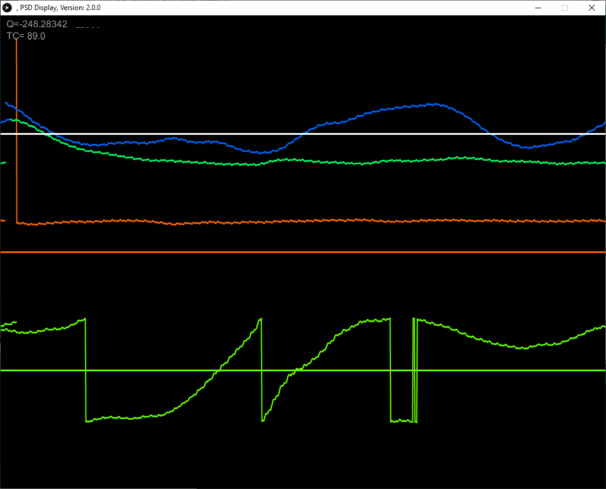
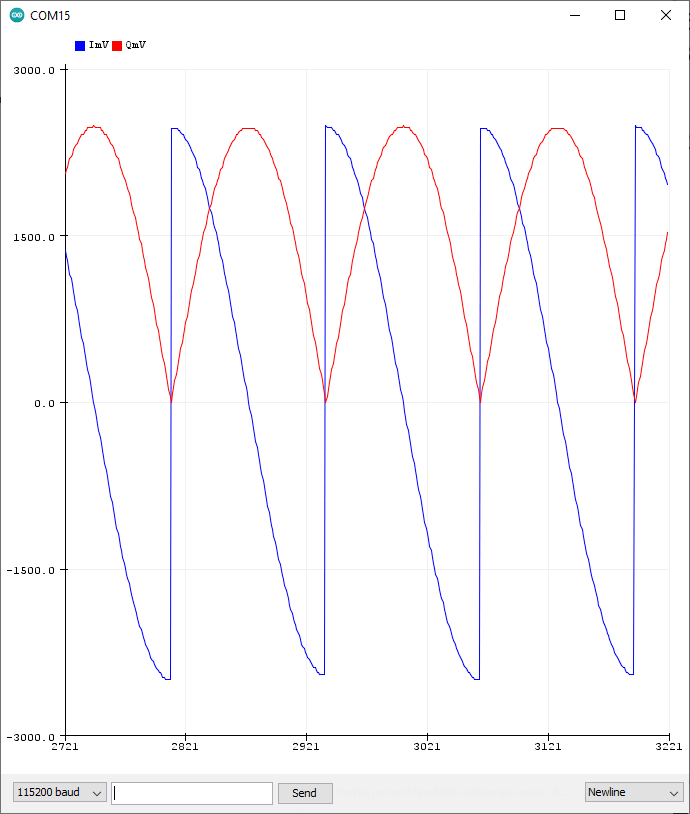
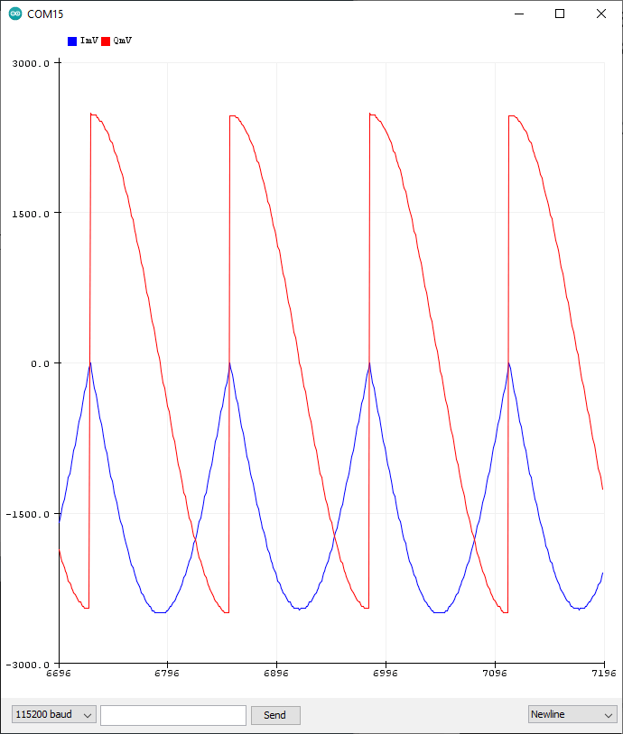

Arduino-Phase-Sensitive-Detector
================================

Arduino and Processing Code GPLv3
Talk CC-BY-SA 4.0

To use this software:
  Download: PSDArduino.ino from the PSDArduino folder and load onto your Arduino
  Download: PSDDrawProcessing.pde from the PSDDrawProcessing folder onto your computer
  
With your arduino running PSDArduino and connected to your computer, run PSDDrawProcessing.pde in the Processing environment

To use the PSD follow PSD_schematic_phase_schem.pdf found in the PSD-Talk folder.

To test the PSD with a phase-shifting circuit follow PhaseShift.pdf in the PSD-Talk folder. The input of the ciruit is attached to the Arduino port supplying the reference signal, the output goes to the Arduino input grabbing the signal. The resistors in the inverting branch should be roughly equal to provide 1V/V gain. I used 10k resistors. The pot in the non-inverting branch was 10k and the capacitor was chosen to create a 90 degree phase shift at the reference frequency, which occurs at 1/(2*pi*R*C). The reference frequency is determined by the Arduino code by fr=(TCNT2 rate)/(OCR2A * wavetable length)

20220202 Forrest Erickson
For the Processing sketch I have modified to show all four traces 

I have added sqaure wave output on pins 7 and 8.
I have moved the sine and cosine table into PROGMEM so 
Sketch uses 4832 bytes (14%) of program storage space. Maximum is 32256 bytes.
Global variables use 715 bytes (34%) of dynamic memory, leaving 1333 bytes for local variables. Maximum is 2048 bytes.

I have stopped the overlfow on the mixer mathematics and scaled the output to -2.5 to 2.5 around Vcc/2.

Here is the Arduino serial plotter output when I input the sqaure wave into the analog input (which I moved to A2 for my hardware) for both the pins 8 and 7 (in phage and 90 degree shift)

**ScreenCaptureIQMPV2.0.0.gif**
  

**SerialPlotPin8I**  
  
 
**SerialPlotPin7Q**  
 
